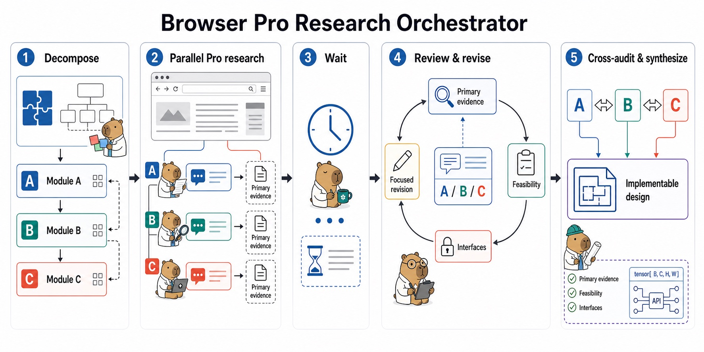

# Browser Pro Research Orchestrator

[English](README.md) · [简体中文](README.zh-CN.md) · **Français**

Utilisez ChatGPT GPT-6 Astra Pro dans le navigateur pour explorer des orientations de recherche, développer des idées originales, concevoir des études et des pipelines scientifiques, avec un orchestrateur local GPT-6 Astra Ultra chargé de l’analyse, de la critique et de la recommandation finale.



## Pourquoi ce skill existe

Un projet de recherche peut exiger une réflexion approfondie avant de disposer de code, de données ou d’une méthode choisie. Ce skill organise des analyses indépendantes autour de la décision actuelle, puis en vérifie localement les preuves, les hypothèses, la faisabilité et les conclusions.

## Modèles par défaut

- Navigateur : **GPT-6 Astra avec le mode Pro sélectionné**, appelé GPT-6 Pro. Le modèle et le mode doivent être vérifiés dans les contrôles visibles avant chaque envoi ; le badge d’abonnement Pro ne suffit pas.
- Orchestrateur local : **GPT-6 Astra avec le raisonnement Ultra**, comme hypothèse de fonctionnement. Le skill ne modifie pas les réglages locaux et n’assimile pas Ultra à un mode Web ou à un paramètre API.
- Un choix explicite pour une exécution ultérieure remplace ce défaut. Sinon, aucun repli silencieux vers GPT-5.6 Pro, Thinking, Auto ou un autre modèle n’est autorisé.

Ces valeurs définissent le workflow, sans garantir l’accès au modèle ni le libellé exact de l’interface. Les autres agents hôtes doivent également satisfaire les exigences de navigateur et de vérification ci-dessous.

## Modes de recherche

| Mode | Décision et livrable |
| --- | --- |
| Orientation | Comparer des questions scientifiques ; proposer un classement et une investigation décisive. |
| Innovation | Développer des contributions candidates ; examiner les travaux les plus proches et les tests de réfutation. |
| Étude | Définir objectifs, hypothèses, protocole, analyse, faisabilité et critères de poursuite, réorientation ou arrêt. |
| Pipeline | Spécifier une référence minimale, une méthode, les interfaces, l’évaluation et les étapes d’implémentation. |
| Critique | Évaluer une proposition à partir de ses objections et explications alternatives les plus solides. |

Choisissez le mode ou la combinaison adapté à la décision actuelle. Le workflow couvre les recherches empiriques, computationnelles, théoriques et qualitatives ; une exploration initiale n’exige ni code, ni données acquises, ni tenseurs ou fonctions de perte. Le brainstorming sans lien avec un projet de recherche et l’implémentation courante sont hors périmètre.

## Fonctionnement

```text
Cadrer la décision et préparer une analyse locale provisoire
→ distinguer faits, hypothèses, contraintes et inconnues
→ préparer le plus petit ensemble utile d’analyses indépendantes
→ vérifier GPT-6 Astra + Pro et envoyer les prompts examinés
→ attendre et capturer les réponses complètes
→ vérifier les sources primaires, critiquer et corriger au besoin
→ réconcilier hypothèses, conclusions et interfaces pertinentes
→ synthétiser une décision de recherche et son prochain test
```

Une question ciblée peut nécessiter une seule conversation ; une décision ouverte difficile bénéficie souvent de deux à quatre. Les corrections sont ciblées et limitées par un budget. Des conversations séparées réduisent l’ancrage, mais l’accord entre modèles ne constitue pas une preuve scientifique indépendante.

L’orchestrateur préserve les longues réponses sans cliquer sur **Answer now**, consigne les envois pour éviter les doublons à la reprise et exclut les échanges dont le modèle n’est pas vérifié jusqu’au remplacement des consultations nécessaires. La recherche Web ordinaire est le défaut ; Deep Research exige une demande explicite.

## Installation

Commencez par cloner ce dépôt :

```bash
git clone <repository-url>
cd browser-pro-research-orchestrator
```

### Codex et Kimi Code

Codex et Kimi Code analysent tous deux le répertoire utilisateur partagé des Agent Skills. Une seule installation peut donc servir aux deux :

```bash
mkdir -p ~/.agents/skills
cp -R skill/browser-pro-research-orchestrator ~/.agents/skills/
```

Pour limiter le skill à un seul projet, copiez-le dans :

```text
<racine-du-projet>/.agents/skills/browser-pro-research-orchestrator/
```

Redémarrez l'agent de codage si le nouveau répertoire principal de skills n'est pas détecté immédiatement.

### Claude Code

Claude Code utilise son propre répertoire de skills personnels :

```bash
mkdir -p ~/.claude/skills
cp -R skill/browser-pro-research-orchestrator ~/.claude/skills/
```

Pour une installation limitée à un projet :

```text
<racine-du-projet>/.claude/skills/browser-pro-research-orchestrator/
```

Sous macOS ou Linux, vous pouvez éviter de maintenir deux copies en installant le skill dans `~/.agents/skills/`, puis en créant un lien symbolique pour Claude Code :

```bash
mkdir -p ~/.claude/skills
ln -s ~/.agents/skills/browser-pro-research-orchestrator \
  ~/.claude/skills/browser-pro-research-orchestrator
```

Le workflow `SKILL.md` et son répertoire `references/` sont portables entre les trois agents. Le fichier `agents/openai.yaml` fournit uniquement des métadonnées d'interface pour Codex ; Kimi Code et Claude Code peuvent l'ignorer.

## Prérequis

- Codex, Kimi Code ou Claude Code avec une intégration de contrôle de Chrome, ou un connecteur de navigateur équivalent capable d'utiliser une session déjà authentifiée ;
- une session de navigateur déjà authentifiée et autorisée à utiliser le modèle Web demandé ;
- l'autorisation de l'utilisateur pour créer des conversations et envoyer des prompts ;
- une destination de chat ou de projet sans ambiguïté et un modèle/mode vérifiable ; un projet Web dédié est facultatif.

L'installation du skill installe uniquement le workflow de recherche. Elle n'installe pas de connecteur de navigateur et ne fournit ni abonnement, ni identifiants, ni session de connexion, ni accès à un modèle. Si l'agent hôte ne peut pas contrôler le navigateur authentifié requis ou vérifier le modèle demandé, le skill s'arrête et signale précisément ce blocage.

## Utilisation

La syntaxe d'appel dépend de l'agent :

| Agent | Invocation explicite |
| --- | --- |
| Codex | `$browser-pro-research-orchestrator` |
| Kimi Code | `/skill:browser-pro-research-orchestrator` |
| Claude Code | `/browser-pro-research-orchestrator` |

Exemple avec Codex :

```text
Utilise $browser-pro-research-orchestrator avec GPT-6 Astra Pro dans Chrome
pour comparer des orientations de recherche, examiner les innovations face
aux travaux les plus proches et recommander une étude et son premier test.
```

Invocation équivalente dans Kimi Code :

```text
/skill:browser-pro-research-orchestrator Décompose ce projet complexe,
lance des recherches Pro indépendantes, évalue chaque proposition de manière
critique et synthétise une conception implémentable.
```

Invocation équivalente dans Claude Code :

```text
/browser-pro-research-orchestrator Décompose ce projet complexe,
lance des recherches Pro indépendantes, évalue chaque proposition de manière
critique et synthétise une conception implémentable.
```

Le skill peut également être activé automatiquement lorsque la demande correspond étroitement à sa description. Une invocation explicite reste préférable pour les longues recherches coûteuses.

Contexte utile à fournir :

- l'objectif du projet et la décision que la recherche doit éclairer ;
- le stade de recherche, les ressources et les éventuels résultats ou implémentations existants ;
- les questions ouvertes ou modules qui bénéficieraient d’analyses indépendantes ;
- les contraintes pertinentes de données, d’accès, de temps et de calcul ;
- les fichiers locaux, dépôts, articles ou conversations antérieures ;
- tout choix explicite remplaçant le modèle Web GPT-6 Astra Pro par défaut ;
- les méthodes interdites, par exemple Deep Research lorsqu'il ne doit pas être utilisé.

Une demande explicite d’utiliser ce skill pour une recherche autorise les conversations ordinaires et les corrections ciblées dans ce périmètre, sans approbation répétée de chaque envoi. La destination doit être sans ambiguïté. Modifier le skill ou préparer seulement des prompts ne lance pas de recherche Web. Les données sensibles, téléversements, partages et suivis récurrents conservent leurs exigences d’autorisation distinctes.

Documentation des plateformes : [Codex Agent Skills](https://learn.chatgpt.com/docs/build-skills), [Kimi Code Agent Skills](https://www.kimi.com/code/docs/en/kimi-code-cli/customization/skills.html) et [Claude Code Skills](https://code.claude.com/docs/en/skills).

## Principes de recherche et d’évaluation

- **Preuves et nouveauté :** Examiner les sources primaires décisives et les travaux les plus proches. Distinguer preuves directes, hypothèses de transfert, concepts et affirmations non étayées. Une recherche infructueuse ne prouve pas la nouveauté.
- **Discrimination et réfutabilité :** Comparer l’idée principale à sa meilleure explication rivale et à une référence simple crédible. Définir le test informatif le moins coûteux et ce qui inverserait la recommandation.
- **Faisabilité adaptée au stade :** Vérifier accès aux ressources, calendrier et validité scientifique. Appliquer les contrôles de fuite de données, d’inférence, de calibration, de tenseurs et de calcul seulement lorsqu’ils sont pertinents.
- **Cohérence et critique :** Relier problème, lacune, contribution, preuves accessibles et conclusion défendable. Préserver les désaccords substantiels plutôt que voter entre réponses de modèles.
- **Itération bornée :** Demander des corrections précises avec contre-exemples. Accepter une décision, différer une affirmation conditionnelle ou rejeter une piste selon les preuves ; la complexité et l’autoévaluation ne sont pas des preuves.

## Sécurité et confidentialité

- Le skill réutilisable ne contient aucun identifiant, cookie, ID de compte, URL de projet fixe, ID de conversation ou chemin de fichier propre à un utilisateur.
- Il fonctionne uniquement avec la session authentifiée de l'utilisateur et ne contourne ni abonnement, ni contrôle d'accès, ni limite d'utilisation.
- Une autorisation est requise avant la création de conversations ou l'envoi de messages.
- Il ne remplace jamais silencieusement le modèle demandé.
- Il n'active jamais Deep Research sans demande explicite.
- Les artefacts d'une exécution peuvent contenir des liens fournis par l'utilisateur ; conservez-les hors du skill réutilisable et vérifiez-les avant tout partage.

## Limites

- Les interfaces Web et les noms de modèles évoluent ; les sélecteurs et étapes de vérification peuvent nécessiter une maintenance.
- Les longues réponses Pro peuvent prendre plusieurs dizaines de minutes et doivent être suivies sans interruption.
- L'accès au navigateur, l'état de connexion, les quotas et la disponibilité du modèle restent des dépendances externes.
- Le résultat soutient une décision de recherche ; la nouveauté et l’efficacité restent provisoires jusqu’aux vérifications de sources, preuves ou expériences pertinentes.

## Structure du dépôt

```text
.
├── README.md
├── README.zh-CN.md
├── README.fr.md
├── docs/
│   └── browser-pro-research-orchestrator-capybara.jpg
└── skill/
    └── browser-pro-research-orchestrator/
        ├── SKILL.md
        ├── agents/
        │   └── openai.yaml
        └── references/
            ├── browser-protocol.md
            ├── prompt-patterns.md
            ├── research-modes.md
            └── review-rubric.md
```

## Avertissement

Il s'agit d'un skill Codex indépendant et non officiel. Il n'est ni affilié à ni approuvé par OpenAI, ChatGPT, Google Chrome ou un fournisseur de modèles. Les noms de produits servent uniquement à décrire la compatibilité.
