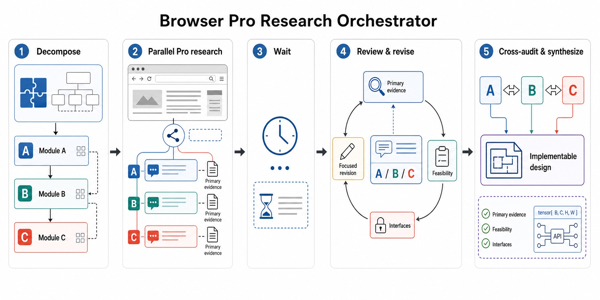

# Browser Pro Research Orchestrator

[English](README.md) · [简体中文](README.zh-CN.md) · **Français**

Transformez une session de navigateur déjà authentifiée et un modèle Pro accessible uniquement sur le Web en un groupe de spécialistes de recherche lents mais indépendants, tout en laissant Codex assurer l'orchestration, l'évaluation critique et la décision finale.



## Pourquoi ce skill existe

Les projets complexes échouent rarement faute d'une seule idée. Plusieurs modules difficiles doivent être étudiés séparément, leurs hypothèses et interfaces doivent rester cohérentes, et la conception finale doit respecter les contraintes de données, de calcul, d'intégration et de déploiement.

Les modèles Pro accessibles sur le Web peuvent fournir des analyses particulièrement vastes et approfondies. Cependant, une unique conversation très longue ne remplace pas une recherche coordonnée : elle mélange facilement les modules, oublie des contraintes et accepte trop vite ses propres propositions.

Ce skill Codex fournit la couche d'orchestration manquante.

## Fonctionnalités

- décomposer un projet complexe en deux à cinq modules de recherche bien délimités ;
- créer des conversations Pro indépendantes grâce à la session Chrome déjà authentifiée de l'utilisateur ;
- vérifier le projet, le modèle et le mode de raisonnement avant chaque envoi ;
- rédiger des prompts riches en contexte demandant une recherche Web ordinaire et des sources primaires ;
- attendre les réponses longues sans cliquer sur **Answer now** ni dégrader le résultat ;
- évaluer chaque proposition selon la qualité des preuves, les fuites de données, la faisabilité, la complexité et le coût opérationnel ;
- envoyer des demandes de correction ciblées ou relancer une conversation qui a dérivé ;
- auditer les interfaces et les responsabilités entre les modules ;
- synthétiser une conception implémentable et falsifiable, avec critères go/no-go et solutions de repli.

Le workflow est indépendant du domaine. Il convient notamment à l'architecture logicielle, la vision par ordinateur, l'apprentissage automatique, les pipelines scientifiques, l'ingénierie système et la conception de produits.

## Fonctionnement

```text
DISCOVER
→ CONTEXT_LOCK
→ DECOMPOSE
→ MODEL_VERIFY
→ PROMPTS_READY
→ THREADS_SENT
→ WAITING
→ REVIEW
→ REVISE
→ CROSS_AUDIT
→ SYNTHESIZE
→ COMPLETE
```

Le modèle Pro est considéré comme une source de propositions de recherche, et non comme une autorité. Un module n'est accepté que lorsque ses preuves, hypothèses, besoins de calcul, protocoles d'évaluation, modes d'échec et interfaces peuvent être examinés.

## Installation

Copiez le skill fourni dans le répertoire des skills Codex :

```bash
cp -R skill/browser-pro-research-orchestrator ~/.codex/skills/
```

Redémarrez ou rouvrez ensuite Codex afin d'actualiser le catalogue des skills.

## Prérequis

- Codex avec une intégration de contrôle de Chrome ou un connecteur de navigateur équivalent ;
- une session de navigateur déjà authentifiée et autorisée à utiliser le modèle Web demandé ;
- l'autorisation de l'utilisateur pour créer des conversations et envoyer des prompts ;
- un projet ou espace de travail cible, un modèle et un mode de raisonnement clairement identifiés.

Le skill ne fournit ni abonnement, ni identifiants, ni session de connexion, ni accès à un modèle.

## Utilisation

Appelez explicitement le skill :

```text
Utilise $browser-pro-research-orchestrator pour décomposer ce projet complexe,
lancer des recherches Pro indépendantes dans Chrome, les évaluer de manière
critique et produire un plan d'implémentation réaliste.
```

Contexte utile à fournir :

- l'objectif du projet et la décision que la recherche doit éclairer ;
- l'implémentation actuelle et les résultats effectivement mesurés ;
- les modules qui doivent être étudiés séparément ;
- les contraintes strictes de données, de calcul, de latence et de déploiement ;
- les fichiers locaux, dépôts, articles ou conversations antérieures ;
- le modèle Web et le mode de raisonnement exacts ;
- les méthodes interdites, par exemple Deep Research lorsqu'il ne doit pas être utilisé.

## Principes de recherche et d'évaluation

### Les preuves avant la nouveauté

Les prompts demandent des sources primaires et distinguent les preuves directes, transférables et seulement conceptuelles. Les lacunes documentaires restent explicites.

### La faisabilité avant la sophistication

Chaque proposition est examinée pour détecter les fuites de données, les entrées indisponibles lors de l'inférence, l'excès de seuils ou de fonctions de perte, les volumes de calcul non bornés, les étapes manuelles cachées et l'exclusion de cas d'échec.

### Les interfaces avant la synthèse

L'audit final vérifie les identifiants, les unités, les formes de tenseurs, la sémantique des valeurs manquantes, la responsabilité des seuils, la calibration, les mécanismes de nouvelle tentative et d'abstention, la provenance des artefacts ainsi que les champs d'entraînement et d'inférence.

### Corriger avant d'accepter

Les conceptions insuffisantes reçoivent des corrigenda ciblés, accompagnés de contre-exemples concrets et de demandes précises concernant les équations, le pseudocode, les interfaces ou les budgets. Une nouvelle conversation est ouverte lorsqu'un fil accumule des hypothèses contradictoires.

## Sécurité et confidentialité

- Le skill réutilisable ne contient aucun identifiant, cookie, ID de compte, URL de projet fixe, ID de conversation ou chemin de fichier propre à un utilisateur.
- Il fonctionne uniquement avec la session authentifiée de l'utilisateur et ne contourne ni abonnement, ni contrôle d'accès, ni limite d'utilisation.
- Une autorisation est requise avant la création de conversations ou l'envoi de messages.
- Il ne remplace jamais silencieusement le modèle demandé.
- Il n'active jamais Deep Research sans demande explicite.
- Les artefacts d'une exécution peuvent contenir des liens fournis par l'utilisateur ; conservez-les hors du skill réutilisable et vérifiez-les avant tout partage.

## Limites

- Les interfaces Web et les noms de modèles évoluent ; les sélecteurs et étapes de vérification peuvent nécessiter une maintenance.
- Les longues réponses Pro peuvent prendre plusieurs dizaines de minutes et doivent être suivies sans interruption.
- L'accès au navigateur, l'état de connexion, les quotas et la disponibilité du modèle restent des dépendances externes.
- Le résultat final est une conception de recherche, et non la preuve d'une amélioration empirique. L'implémentation et l'évaluation restent nécessaires.

## Structure du dépôt

```text
.
├── README.md
├── README.zh-CN.md
├── README.fr.md
├── docs/
│   └── browser-pro-research-orchestrator.jpg
└── skill/
    └── browser-pro-research-orchestrator/
        ├── SKILL.md
        ├── agents/
        │   └── openai.yaml
        └── references/
            ├── prompt-patterns.md
            └── review-rubric.md
```

## Avertissement

Il s'agit d'un skill Codex indépendant et non officiel. Il n'est ni affilié à ni approuvé par OpenAI, ChatGPT, Google Chrome ou un fournisseur de modèles. Les noms de produits servent uniquement à décrire la compatibilité.
